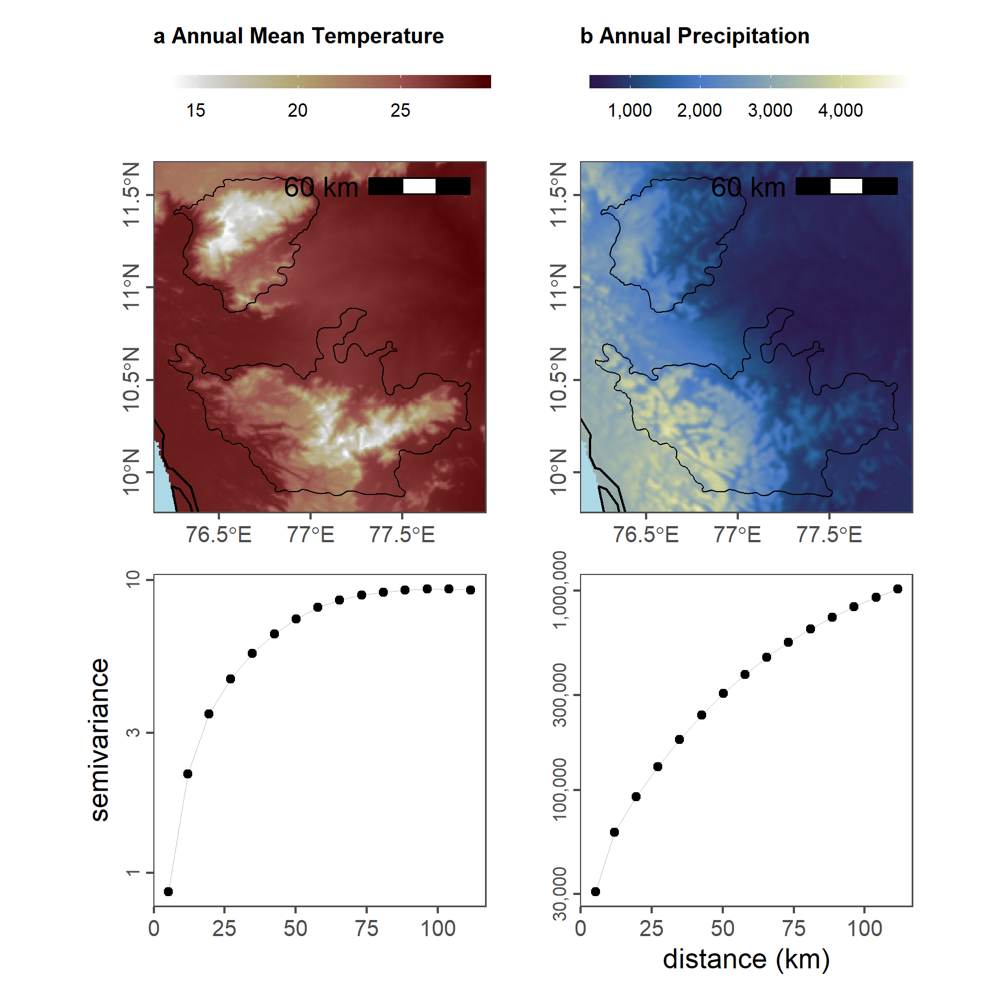

--- 
knit: "bookdown::render_book"
title: "Supplementary material for _Using citizen science to parse climatic and landcover influences on bird occupancy within a tropical biodiversity hotspot_"
author:
    - Vijay Ramesh
    - Pratik R. Gupte
    - Morgan W. Tingley
    - VV Robin
    - Ruth DeFries
date: "`r Sys.Date()`"
site: bookdown::bookdown_site
output: 
  bookdown::gitbook:
    fig_caption: yes
  bookdown::pdf_document2:
    documentclass: scrreprt
    toc-depth: 1
    secnumdepth: 2
    geometry: "left=4cm, right=3cm, top=2.5cm, bottom=2.5cm"
github-repo: pratikunterwegs/ebird-wghats-supplement
---
```{r include=FALSE, cache=FALSE}
knitr::opts_knit$set(root.dir = here::here())
set.seed(1)
options(digits = 3)

knitr::opts_chunk$set(
  comment = "#>",
  collapse = TRUE,
  cache = FALSE,
  eval = FALSE,
  warning = FALSE,
  error = FALSE,
  message = FALSE,
  out.width = "\\textwidth",
  attr.source = ".numberLines",
  fig.align = "center",
  fig.width = 7,
  fig.asp = 0.618, # 1 / phi
  fig.show = "hold",
  python.reticulate = FALSE
)
options(knitr.kable.NA = "")
options(dplyr.print_min = 6, dplyr.print_max = 6)
```

# Introduction

This is supplementary material for a project in preparation that models occupancy for birds in the southern Western Ghats, India. 
The main project can be found here: [https://github.com/pratikunterwegs/eBirdOccupancy](https://github.com/pratikunterwegs/eBirdOccupancy).

## Attribution

Please contact the following in case of interest in the project.

- Vijay Ramesh (lead author)
    - PhD student, Columbia University

- Pratik Gupte (repo maintainer)
    - PhD student, University of Groningen

<!--chapter:end:index.rmd-->

---
editor_options: 
  chunk_output_type: console
---
```{r include=FALSE, cache=FALSE}
knitr::opts_knit$set(root.dir = here::here())
set.seed(1)
options(digits = 3)

knitr::opts_chunk$set(
  comment = "#>",
  collapse = TRUE,
  cache = FALSE,
  eval = FALSE,
  warning = FALSE,
  error = FALSE,
  message = FALSE,
  out.width = "\\textwidth",
  attr.source = ".numberLines",
  fig.align = "center",
  fig.width = 7,
  fig.asp = 0.618, # 1 / phi
  fig.show = "hold",
  python.reticulate = FALSE
)
options(knitr.kable.NA = "")
options(dplyr.print_min = 6, dplyr.print_max = 6)
```

# Predicting Species-specific Occupancy

This supplement plots species-specific probabilities of occupancy as a function of significant environmental predictors. 

## Prepare libraries

```{r load_libs_results02, eval=FALSE}
# to load data
library(readxl)

# to handle data
library(dplyr)
library(readr)
library(forcats)
library(tidyr)
library(purrr)
library(stringr)

# plotting
library(ggplot2)
library(patchwork)
```

## Read data

```{r}
# read data
data <- read_csv("data/results/data_occupancy_predictors.csv")
```

```{r}
# drop na
data <- select(
  data,
  -ci
) %>%
  drop_na() %>%
  nest(data = c(predictor, m_group, seq_x, mean, scale))
```

```{r echo=FALSE}
fig_occupancy <- map2(
  data$data, data$scientific_name,
  function(df, name) {
    ggplot(df) +
      geom_line(aes(seq_x, mean,
        col = predictor
      )) +
      facet_grid(~scale,
        labeller = label_both
      ) +
      coord_cartesian(
        xlim = c(0, 1),
        ylim = c(0, 1)
      ) +
      theme_grey(base_size = 6) +
      theme(legend.position = "top") +
      scale_colour_manual(values = pals::kovesi.rainbow(8)) +
      labs(
        x = "scaled predictor value",
        y = "p(occupancy)",
        title = name
      )
  }
)
```

```{r echo=FALSE}
cairo_pdf(
  filename = "figs/fig_occupancy_predictors.pdf",
  onefile = TRUE, width = 6, height = 4
)
fig_occupancy
dev.off()
```

Figure code is hidden in versions rendered as HTML and PDF.
Example output is shown below.

**Figure here**

<!--chapter:end:07_results_occupancy_predictors.Rmd-->

---
editor_options: 
  chunk_output_type: console
---
```{r include=FALSE, cache=FALSE}
knitr::opts_knit$set(root.dir = here::here())
set.seed(1)
options(digits = 3)

knitr::opts_chunk$set(
  comment = "#>",
  collapse = TRUE,
  cache = FALSE,
  eval = FALSE,
  warning = FALSE,
  error = FALSE,
  message = FALSE,
  out.width = "\\textwidth",
  attr.source = ".numberLines",
  fig.align = "center",
  fig.width = 7,
  fig.asp = 0.618, # 1 / phi
  fig.show = "hold",
  python.reticulate = FALSE
)
options(knitr.kable.NA = "")
options(dplyr.print_min = 6, dplyr.print_max = 6)
```

# Selecting species of interest

This script shows the proportion of checklists that report a particular species across every 25km by 25km grid across the Nilgiris and the Anamalais. Using this analysis, we arrived at a final list of species for occupancy modeling.

We derived this list from inclusion criteria adapted from the State of India’s Birds 2020 (Viswanathan et al., 2020). Initially, we considered all 561 species in eBird that occurred within the outlines of our study area. We then considered only those species that had a minimum of 1000 detections each between 2013 and 2019 (reducing to 303 species). Next, the study area was divided into 25 x 25 km cells following (Viswanathan et al., 2020). We then kept only those species that occurred in at least 5% of all checklists across 50% of the 25 x 25 km cells from where they have been reported (reducing to 93 species). We used the above criteria to ensure as much uniform sampling of a species as possible across our study area and to reduce any erroneous associations between environmental drivers and species occupancy. Across our final list of 93 species, we analyzed a total of ~3.2 million detections (presences) between 2013 and 2019. 

## Prepare libraries

```{r setup_sup_02, eval=FALSE}
# load libraries
library(data.table)
library(readxl)
library(magrittr)
library(stringr)
library(dplyr)
library(tidyr)
library(readr)

library(ggplot2)
library(ggthemes)
library(scico)

# round any function
round_any <- function(x, accuracy = 25000) {
  round(x / accuracy) * accuracy
}
```

## Read species of interest

```{r soi_supplement, eval=FALSE, message=FALSE, warning=FALSE}
# add species of interest
specieslist <- read.csv("data/species_list.csv")
speciesOfInterest <- specieslist$scientific_name
```

## Load raw data for locations

```{r load_raw_data_supp02, eval=FALSE}
# read in shapefile of the study area to subset by bounding box
library(sf)
wg <- st_read("data/spatial/hillsShapefile/Nil_Ana_Pal.shp")
box <- st_bbox(wg)

# read in data and subset
ebd <- fread("data/01_ebird-filtered-EBD-westernGhats.txt")
ebd <- ebd[between(LONGITUDE, box["xmin"], box["xmax"]) &
  between(LATITUDE, box["ymin"], box["ymax"]), ]
ebd <- ebd[year(`OBSERVATION DATE`) >= 2013, ]

# make new column names
newNames <- str_replace_all(colnames(ebd), " ", "_") %>%
  str_to_lower()
setnames(ebd, newNames)

# keep useful columns
columnsOfInterest <- c(
  "scientific_name", "observation_count", "locality",
  "locality_id", "locality_type", "latitude",
  "longitude", "observation_date", "sampling_event_identifier"
)

ebd <- ebd[, ..columnsOfInterest]
```

Add a spatial filter and assign grids of 25km x 25km. 

```{r strict_filter_supp02, eval=FALSE}
# strict spatial filter and assign grid
locs <- ebd[, .(longitude, latitude)]

# transform to UTM and get 20km boxes
coords <- setDF(locs) %>%
  st_as_sf(coords = c("longitude", "latitude")) %>%
  `st_crs<-`(4326) %>%
  bind_cols(as.data.table(st_coordinates(.))) %>%
  st_transform(32643) %>%
  mutate(id = 1:nrow(.))

# convert wg to UTM for filter
wg <- st_transform(wg, 32643)
coords <- coords %>%
  filter(id %in% unlist(st_contains(wg, coords))) %>%
  rename(longitude = X, latitude = Y) %>%
  bind_cols(as.data.table(st_coordinates(.))) %>%
  st_drop_geometry() %>%
  as.data.table()

# remove unneeded objects
rm(locs)
gc()

coords <- coords[, .N, by = .(longitude, latitude, X, Y)]

ebd <- merge(ebd, coords, all = FALSE, by = c("longitude", "latitude"))

ebd <- ebd[(longitude %in% coords$longitude) &
  (latitude %in% coords$latitude), ]
```

## Get proportional obs counts in 25km cells

```{r count_obs_cell, eval=FALSE}
# round to 25km cell in UTM coords
ebd[, `:=`(X = round_any(X), Y = round_any(Y))]

# count checklists in cell
ebd_summary <- ebd[, nchk := length(unique(sampling_event_identifier)),
  by = .(X, Y)
]

# count checklists reporting each species in cell and get proportion
ebd_summary <- ebd_summary[, .(nrep = length(unique(
  sampling_event_identifier
))),
by = .(X, Y, nchk, scientific_name)
]

ebd_summary[, p_rep := nrep / nchk]

# filter for soi
ebd_summary <- ebd_summary[scientific_name %in% speciesOfInterest, ]

# complete the dataframe for no reports
# keep no reports as NA --- allows filtering based on proportion reporting
ebd_summary <- setDF(ebd_summary) %>%
  complete(
    nesting(X, Y), scientific_name # ,
    # fill = list(p_rep = 0)
  ) %>%
  filter(!is.na(p_rep))
```

## Which species are reported sufficiently in checklists?

```{r eval=FALSE}
# A total of 42 unique grids (of 25km by 25km) across the study area
# total number of checklists across unique grids

tot_n_chklist <- ebd_summary %>%
  distinct(X, Y, nchk)

# species-specific number of grids
spp_grids <- ebd_summary %>%
  group_by(scientific_name) %>%
  distinct(X, Y) %>%
  count(scientific_name,
    name = "n_grids"
  )

# Write the above two results
write_csv(tot_n_chklist, "data/nchk_per_grid.csv")
write_csv(spp_grids, "data/ngrids_per_spp.csv")

# left-join the datasets
ebd_summary <- left_join(ebd_summary, spp_grids, by = "scientific_name")

# check the proportion of grids across which this cut-off is met for each species
# Is it > 90% or 70%?
# For example, with a 3% cut-off, ~100 species are occurring in >50%
# of the grids they have been reported in

p_cutoff <- 0.05 # Proportion of checklists a species has been reported in
grid_proportions <- ebd_summary %>%
  group_by(scientific_name) %>%
  tally(p_rep >= p_cutoff) %>%
  mutate(prop_grids_cut = n / (spp_grids$n_grids)) %>%
  arrange(desc(prop_grids_cut))

grid_prop_cut <- filter(
  grid_proportions,
  prop_grids_cut > p_cutoff
)

# Write the results
write_csv(grid_prop_cut, "data/chk_5_percent.csv")

# Identifying the number of species that occur in potentially <5% of all lists
total_number_lists <- sum(tot_n_chklist$nchk)

spp_sum_chk <- ebd_summary %>%
  distinct(X, Y, scientific_name, nrep) %>%
  group_by(scientific_name) %>%
  mutate(sum_chk = sum(nrep)) %>%
  distinct(scientific_name, sum_chk)

# Approximately 90 to 100 species occur in >5% of all checklists
prop_all_lists <- spp_sum_chk %>%
  mutate(prop_lists = sum_chk / total_number_lists) %>%
  arrange(desc(prop_lists))
```

## Figure: Checklist distribution

```{r load_map_plot_data, eval=FALSE}
# add land
library(rnaturalearth)
land <- ne_countries(
  scale = 50, type = "countries", continent = "asia",
  country = "india",
  returnclass = c("sf")
)

# crop land
land <- st_transform(land, 32643)
```

```{r plot_obs_distributions, eval=FALSE, echo=FALSE}
# make plot
wg <- st_transform(wg, 32643)
bbox <- st_bbox(wg)

# get a plot of number of checklists across grids
plotNchk <-
  ggplot() +
  geom_sf(data = land, fill = "grey90", col = NA) +
  geom_tile(
    data = tot_n_chklist,
    aes(X, Y, fill = nchk), lwd = 0.5, col = "grey90"
  ) +
  geom_sf(data = wg, fill = NA, col = "black", lwd = 0.3) +
  scale_fill_scico(
    palette = "lajolla",
    direction = 1,
    trans = "log10",
    limits = c(1, 10000),
    breaks = 10^c(1:4)
  ) +
  coord_sf(xlim = bbox[c("xmin", "xmax")], ylim = bbox[c("ymin", "ymax")]) +
  theme_few() +
  theme(
    legend.position = "right",
    axis.title = element_blank(),
    axis.text.y = element_text(angle = 90),
    panel.background = element_rect(fill = "lightblue")
  ) +
  labs(fill = "number\nof\nchecklists")

# export data
ggsave(plotNchk,
  filename = "figs/fig_number_checklists_25km.png", height = 12,
  width = 7, device = png(), dpi = 300
)
dev.off()

# filter list of species
ebd_filter <- semi_join(ebd_summary, grid_prop_cut, by = "scientific_name")

plotDistributions <-
  ggplot() +
  geom_sf(data = land, fill = "grey90", col = NA) +
  geom_tile(
    data = ebd_filter,
    aes(X, Y, fill = p_rep), lwd = 0.5, col = "grey90"
  ) +
  geom_sf(data = wg, fill = NA, col = "black", lwd = 0.3) +
  scale_fill_scico(palette = "lajolla", direction = 1, label = scales::percent) +
  facet_wrap(~scientific_name, ncol = 12) +
  coord_sf(xlim = bbox[c("xmin", "xmax")], ylim = bbox[c("ymin", "ymax")]) +
  ggthemes::theme_few(
    base_family = "TT Arial",
    base_size = 8
  ) +
  theme(
    legend.position = "right",
    strip.text = element_text(face = "italic"),
    axis.title = element_blank(),
    axis.text.y = element_text(angle = 90),
    panel.background = element_rect(fill = "lightblue")
  ) +
  labs(fill = "prop.\nreporting\nchecklists")

# export data
ggsave(plotDistributions,
  filename = "figs/fig_species_distributions.png",
  height = 25, width = 25, device = png(), dpi = 300
)
dev.off()
```


## Prepare the species list

```{r}
# write the new list of species that occur in at least 5% of checklists across a minimum of 50% of the grids they have been reported in

new_sp_list <- semi_join(specieslist, grid_prop_cut, by = "scientific_name")

write_csv(new_sp_list, "data/03_list-of-species-cutoff.csv")
```

<!--chapter:end:09_supplement02_spp-chk-per-grid.rmd-->

---
editor_options: 
  chunk_output_type: console
---
```{r include=FALSE, cache=FALSE}
knitr::opts_knit$set(root.dir = here::here())
set.seed(1)
options(digits = 3)

knitr::opts_chunk$set(
  comment = "#>",
  collapse = TRUE,
  cache = FALSE,
  eval = FALSE,
  warning = FALSE,
  error = FALSE,
  message = FALSE,
  out.width = "\\textwidth",
  attr.source = ".numberLines",
  fig.align = "center",
  fig.width = 7,
  fig.asp = 0.618, # 1 / phi
  fig.show = "hold",
  python.reticulate = FALSE
)
options(knitr.kable.NA = "")
options(dplyr.print_min = 6, dplyr.print_max = 6)
```

# Climate in Relation to Landcover

This script showcases how climate data varies as a function of land cover types across our study area. 

## Prepare libraries

```{r prep_libs_supp04, eval=FALSE}
# load libs
library(raster)
library(glue)
library(purrr)
library(dplyr)
library(tidyr)

# plotting options
library(ggplot2)
library(ggthemes)
library(scico)

# get ci func
ci <- function(x) {
  qnorm(0.975) * sd(x, na.rm = T) / sqrt(length(x))
}
```

## Prepare environmental data

```{r load_rasters_supp4, eval=FALSE}
# read landscape prepare for plotting
landscape <- stack("data/spatial/landscape_resamp01km.tif")

# get proper names
elev_names <- c("elev", "slope", "aspect")
chelsa_names <- c("bio_01", "bio_12")

names(landscape) <- as.character(glue('{c(elev_names, chelsa_names, "landcover")}'))
```

```{r get_data_at_lc, eval=FALSE}
# make duplicate stack
land_data <- landscape[[c("landcover", chelsa_names)]]

# convert to list
land_data <- as.list(land_data)

# map get values over the stack
land_data <- purrr::map(land_data, raster::getValues)
names(land_data) <- c("landcover", chelsa_names)

# conver to dataframe and round to 100m
land_data <- bind_cols(land_data)
land_data <- drop_na(land_data) %>%
  filter(landcover != 0) %>%
  pivot_longer(
    cols = contains("bio"),
    names_to = "clim_var"
  ) # %>%
# group_by(landcover, clim_var) %>%
# summarise_all(.funs = list(~mean(.), ~ci(.)))
```

## Climatic variables over landcover

Figure code is hidden in versions rendered as HTML and PDF.

```{r plot_clim_lc, eval=FALSE, echo=FALSE}
# plot in facets
fig_climate_lc <- ggplot(land_data) +
  geom_jitter(aes(
    x = landcover - 0.25, y = value,
    col = factor(landcover)
  ),
  width = 0.2,
  size = 0.1, alpha = 0.1, shape = 4
  ) +
  geom_boxplot(aes(x = landcover + 0.25, y = value, group = landcover),
    width = 0.2,
    outlier.size = 0.2, alpha = 0.3, fill = NA
  ) +
  scale_colour_scico_d(begin = 0.2, end = 0.8) +
  scale_y_continuous(labels = scales::comma) +
  scale_x_continuous(breaks = c(1:7)) +
  facet_wrap(~clim_var, scales = "free_y") +
  theme_few() +
  theme(legend.position = "none") +
  labs(x = "landcover class", y = "CHELSA variable value")

# save as png
ggsave(fig_climate_lc,
  filename = "figs/fig_climate_landcover.png",
  height = 5, width = 8, device = png(), dpi = 300
)
dev.off()
```


<!--chapter:end:11_supplement04-climate-vs-landcover.rmd-->

---
editor_options: 
  chunk_output_type: console
---
```{r include=FALSE, cache=FALSE}
knitr::opts_knit$set(root.dir = here::here())
set.seed(1)
options(digits = 3)

knitr::opts_chunk$set(
  comment = "#>",
  collapse = TRUE,
  cache = FALSE,
  eval = FALSE,
  warning = FALSE,
  error = FALSE,
  message = FALSE,
  out.width = "\\textwidth",
  attr.source = ".numberLines",
  fig.align = "center",
  fig.width = 7,
  fig.asp = 0.618, # 1 / phi
  fig.show = "hold",
  python.reticulate = FALSE
)
options(knitr.kable.NA = "")
options(dplyr.print_min = 6, dplyr.print_max = 6)
```

# Distribution of Observer Expertise

This script plots observer expertise over time (2013-2019) as well as across land cover types. 
## Prepare libraries

```{r prep_libs_supp05, eval=FALSE}
# load libs
library(raster)
library(glue)
library(purrr)
library(dplyr)
library(tidyr)
library(readr)
library(scales)

# plotting libs
library(ggplot2)
library(ggthemes)
library(scico)

# get ci func
ci <- function(x) {
  qnorm(0.975) * sd(x, na.rm = T) / sqrt(length(x))
}
```

## Load observer expertise scores and checklist covariates

```{r load_data_supp05, eval=FALSE, message=FALSE}
# read in scores and checklist data and link
scores <- read_csv("data/03_data-obsExpertise-score.csv")
data <- read_csv("data/03_data-covars-perChklist.csv")

data <- left_join(data, scores, by = c("observer" = "observer"))
data <- dplyr::select(data, score, nSp, nSoi, landcover, year) %>%
  filter(!is.na(score))
```

## Species observed in relation to observer expertise

```{r nsp_expertise, eval=FALSE, message=FALSE}
# summarise data by rounded score and year
data_summary01 <- data %>%
  mutate(score = plyr::round_any(score, 0.2)) %>%
  dplyr::select(score, year, nSp, nSoi) %>%
  pivot_longer(
    cols = c("nSp", "nSoi"),
    names_to = "variable", values_to = "value"
  ) %>%
  group_by(score, year, variable) %>%
  summarise_at(vars(value), list(~ mean(.), ~ ci(.)))

# make plot and export
fig_nsp_score <-
  ggplot(data_summary01) +
  geom_jitter(
    data = data, aes(x = score, y = nSp),
    col = "grey", alpha = 0.2, size = 0.1
  ) +
  geom_pointrange(aes(
    x = score, y = mean,
    ymin = mean - ci, ymax = mean + ci,
    col = as.factor(variable)
  ),
  position = position_dodge(width = 0.05)
  ) +
  facet_wrap(~year) +
  scale_y_log10() +
  #  coord_cartesian(ylim=c(0,50))+
  scale_colour_scico_d(palette = "cork", begin = 0.2, end = 0.8) +
  labs(x = "CCI", y = "Number of Species Reported") +
  theme_few() +
  theme(legend.position = "none")

# export figure
ggsave(filename = "figs/fig_nsp_score.png", width = 12, height = 7, device = png(), dpi = 300)
dev.off()
```


## Observer expertise in relation to landcover

Figure code is hidden in versions rendered as HTML or PDF.

```{r exp_landcover, eval=FALSE, message=FALSE, echo=FALSE}
# plot histograms of expertise scores in different landcover classes
data <- filter(data, !is.na(landcover))

# make plot
fig_exp_lc <- ggplot(data) +
  geom_histogram(aes(x = score), fill = "steelblue", bins = 20) +
  facet_wrap(~landcover, scales = "free_y", labeller = label_both, nrow = 2) +
  scale_y_continuous(labels = comma) +
  theme_few() +
  theme(legend.position = "none") +
  labs(x = "expertise score", y = "count")

# export figure

ggsave(filename = "figs/fig_exp_lc.png", width = 8, height = 4, device = png(), dpi = 300)
dev.off()
```


<!--chapter:end:12_supplement05-obsExp-vs-time.rmd-->

---
editor_options: 
  chunk_output_type: console
---
```{r include=FALSE, cache=FALSE}
knitr::opts_knit$set(root.dir = here::here())
set.seed(1)
options(digits = 3)

knitr::opts_chunk$set(
  comment = "#>",
  collapse = TRUE,
  cache = FALSE,
  eval = FALSE,
  warning = FALSE,
  error = FALSE,
  message = FALSE,
  out.width = "\\textwidth",
  attr.source = ".numberLines",
  fig.align = "center",
  fig.width = 7,
  fig.asp = 0.618, # 1 / phi
  fig.show = "hold",
  python.reticulate = FALSE
)
options(knitr.kable.NA = "")
options(dplyr.print_min = 6, dplyr.print_max = 6)
```

# Spatial Autocorrelation of Climatic Predictors

## Load libraries

```{r load_libs_supp06, eval=FALSE, message=FALSE}
# load libs
library(raster)
library(gstat)
library(stars)
library(purrr)
library(tibble)
library(dplyr)
library(tidyr)
library(glue)
library(scales)
library(gdalUtils)
library(sf)

# plot libs
library(ggplot2)
library(ggthemes)
library(scico)
library(gridExtra)
library(cowplot)
library(ggspatial)

#' make custom functiont to convert matrix to df
raster_to_df <- function(inp) {

  # assert is a raster obj
  assertthat::assert_that("RasterLayer" %in% class(inp),
    msg = "input is not a raster"
  )

  coords <- coordinates(inp)
  vals <- getValues(inp)

  data <- tibble(x = coords[, 1], y = coords[, 2], value = vals)

  return(data)
}
```

## Prepare data

```{r load_data_supp06, eval=FALSE, message=FALSE}
# list landscape covariate stacks
landscape_files <- "data/spatial/landscape_resamp01_km.tif"
landscape_data <- stack(landscape_files)

# get proper names
elev_names <- c("elev", "slope", "aspect")
chelsa_names <- c("bio_01", "bio_12")
names(landscape_data) <- c(elev_names, chelsa_names, "landcover")


# get chelsa rasters
chelsa <- landscape_data[[chelsa_names]]
chelsa <- purrr::map(as.list(chelsa), raster_to_df)
```

## Calculate variograms of environmental layers

```{r make_variograms, eval=FALSE, message=FALSE}
# prep variograms
vgrams <- purrr::map(chelsa, function(z) {
  z <- drop_na(z)
  vgram <- gstat::variogram(value ~ 1, loc = ~ x + y, data = z)
  return(vgram)
})

# save temp
save(vgrams, file = "data/chelsa/chelsaVariograms.rdata")

# get variogram data
vgrams <- purrr::map(vgrams, function(df) {
  df %>% select(dist, gamma)
})
vgrams <- tibble(
  variable = chelsa_names,
  data = vgrams
)
```

```{r load_map_data, eval=FALSE, message = FALSE}
wg <- st_read("data/spatial/hillsShapefile/Nil_Ana_Pal.shp") %>%
  st_transform(32643)
bbox <- st_bbox(wg)

# add lamd
library(rnaturalearth)
land <- ne_countries(
  scale = 50, type = "countries", continent = "asia",
  country = "india",
  returnclass = c("sf")
)

# crop land
land <- st_transform(land, 32643)
```

## Visualise variograms of environmental data

```{r plot_variograms_maps, eval=FALSE, message=FALSE}
# make ggplot of variograms
yaxis <- c("semivariance", "")
xaxis <- c("", "distance (km)")
fig_vgrams <- purrr::pmap(list(vgrams$data, yaxis, xaxis), function(df, ya, xa) {
  ggplot(df) +
    geom_line(aes(x = dist / 1000, y = gamma), size = 0.2, col = "grey") +
    geom_point(aes(x = dist / 1000, y = gamma), col = "black") +
    scale_x_continuous(labels = comma, breaks = c(seq(0, 100, 25))) +
    scale_y_log10(labels = comma) +
    labs(x = xa, y = ya) +
    theme_few() +
    theme(
      axis.text.y = element_text(angle = 90, hjust = 0.5, size = 8),
      strip.text = element_blank()
    )
})
# fig_vgrams <- purrr::map(fig_vgrams, ggplot2::ggplotGrob)

# make ggplot of chelsa data
chelsa <- as.list(landscape_data[[chelsa_names]]) %>%
  purrr::map(stars::st_as_stars)

# colour palettes
pal <- c("bilbao", "davos")
title <- c(
  "a Annual Mean Temperature",
  "b Annual Precipitation"
)
direction <- c(1, 1)
lims <- list(
  range(values(landscape_data$bio_01), na.rm = T),
  range(values(landscape_data$bio_12), na.rm = T)
)
fig_list_chelsa <-
  purrr::pmap(
    list(chelsa, pal, title, direction, lims),
    function(df, pal, t, d, l) {
      ggplot() +
        stars::geom_stars(data = df) +
        geom_sf(data = land, fill = NA, colour = "black") +
        geom_sf(data = wg, fill = NA, colour = "black", size = 0.3) +
        scale_fill_scico(
          palette = pal, direction = d,
          label = comma, na.value = NA, limits = l
        ) +
        coord_sf(
          xlim = bbox[c("xmin", "xmax")],
          ylim = bbox[c("ymin", "ymax")]
        ) +
        ggspatial::annotation_scale(location = "tr", width_hint = 0.4, text_cex = 1) +
        theme_few() +
        theme(
          legend.position = "top",
          title = element_text(face = "bold", size = 8),
          legend.key.height = unit(0.2, "cm"),
          legend.key.width = unit(1, "cm"),
          legend.text = element_text(size = 8),
          axis.title = element_blank(),
          axis.text.y = element_text(angle = 90, hjust = 0.5),
          panel.background = element_rect(fill = "lightblue"),
          legend.title = element_blank()
        ) +
        labs(x = NULL, y = NULL, title = t)
    }
  )
# fig_list_chelsa <- purrr::map(fig_list_chelsa, ggplotGrob)
```

```{r prep_figures_vgrams, eval=FALSE, message=FALSE}
# fig_list_chelsa <- append(fig_list_chelsa, fig_vgrams)
# lmatrix <- matrix(c(c(1, 2, 3, 4, 5), c(1, 2, 3, 4, 5), c(6, 7, 8, 9, 10)),
#   nrow = 3, byrow = T
# )
# plot_grid <- grid.arrange(grobs = fig_list_chelsa, layout_matrix = lmatrix)
#
# ggsave(
#   plot = plot_grid, filename = "figs/fig_chelsa_variograms.png",
#   dpi = 300, width = 12, height = 6
# )
# dev.off()

library(patchwork)
fig_variogram <- wrap_plots(append(fig_list_chelsa, fig_vgrams))
ggsave(fig_variogram,
  filename = "figs/fig_chelsa_variograms.png",
  dpi = 300,
  width = 6, height = 6
)
```



# Climatic raster resampling

## Prepare landcover

```{r resample_landcover_mult, eval=FALSE, warning=FALSE, message=FALSE}
# read in landcover raster location
landcover <- "data/landUseClassification/classifiedImage-UTM.tif"
# get extent
e <- bbox(raster(landcover))

# init resolution
res_init <- res(raster(landcover))
# res to transform to 1000m
res_final <- map(c(100, 250, 500, 1e3, 2.5e3), function(x) {
  x * res_init
})

# use gdalutils gdalwarp for resampling transform
# to 1km from 10m
for (i in 1:length(res_final)) {
  this_res <- res_final[[i]]
  this_res_char <- stringr::str_pad(this_res[1], 5, pad = "0")
  gdalUtils::gdalwarp(
    srcfile = landcover,
    dstfile = as.character(glue("data/landUseClassification/lc_{this_res_char}m.tif")),
    tr = c(this_res), r = "mode", te = c(e)
  )
}
```

```{r read_resampled_lc, eval=FALSE, message=FALSE, warning=FALSE}
# read in resampled landcover raster files as a list
lc_files <- list.files("data/landUseClassification/", pattern = "lc", full.names = TRUE)
lc_data <- map(lc_files, raster)
```

## Prepare spatial extent

```{r load_hills_s06, eval=FALSE, message=FALSE, warning=FALSE}
# load hills
library(sf)
hills <- st_read("data/spatial/hillsShapefile/Nil_Ana_Pal.shp")
hills <- st_transform(hills, 32643)
buffer <- st_buffer(hills, 3e4) %>%
  st_transform(4326)
bbox <- st_bbox(hills)
```

## Prepare CHELSA rasters

```{r chelsa_rasters_s06, eval=FALSE, message=FALSE, warning=FALSE}
# list chelsa files
chelsaFiles <- list.files("data/chelsa/", full.names = TRUE, pattern = "*.tif")

# gather chelsa rasters
chelsaData <- purrr::map(chelsaFiles, function(chr) {
  a <- raster(chr)
  crs(a) <- crs(buffer)
  a <- crop(a, as(buffer, "Spatial"))
  return(a)
})

# stack chelsa data
chelsaData <- raster::stack(chelsaData)
names(chelsaData) <- c("chelsa_bio10_01", "chelsa_bio10_12")
```

## Resample prepared rasters

```{r resample_clim_rasters, eval=FALSE, message=FALSE}
# make resampled data
resamp_data <- map(lc_data, function(this_scale) {
  rr <- projectRaster(
    from = chelsaData, to = this_scale,
    crs = crs(this_scale), res = res(this_scale)
  )
})

# make a stars list
resamp_data <- map2(resamp_data, lc_data, function(z1, z2) {
  z2[z2 == 0] <- NA
  z2 <- append(z2, as.list(z1)) %>% map(stars::st_as_stars)
}) %>%
  flatten()
```

```{r plot_resampled_rasters, eval=FALSE, message=FALSE, echo=FALSE}
# colour palettes
pal <- c("batlow", "bilbao")
title <- c(
  "a Annual Mean Temperature",
  "b Annual Precipitation"
)
title <- c(title, rep("", 24))
direction <- c(1, 1)

scales <- c(
  c("1.0km", rep("", 5)), c("2.5km", rep("", 5)),
  c("5.0km", rep("", 5)), c("10km", rep("", 5)),
  c("25km", rep("", 5))
)

# make figures across the list
fig_list_chelsa_resamp <-
  purrr::pmap(
    list(resamp_data, scales, rep(pal, 5), title, rep(direction, 5)),
    function(df, scale, pal, t, d) {
      ggplot() +
        geom_stars(data = df) +
        geom_sf(data = hills, fill = NA, colour = "black", size = 0.3) +
        scale_fill_scico(
          palette = pal, direction = d,
          label = comma, na.value = NA
        ) +
        coord_sf(
          xlim = bbox[c("xmin", "xmax")],
          ylim = bbox[c("ymin", "ymax")]
        ) +
        theme_void() +
        theme( # legend.position = "top",
          panel.border = element_rect(),
          title = element_text(face = "bold", size = 8),
          # legend.key.height = unit(0.1, "cm"),
          # legend.key.width = unit(0.6, "cm"),
          # legend.text = element_text(size = 8),
          axis.title = element_text(),
          axis.title.y = element_text(angle = 90),
          # axis.text.y = element_text(angle = 90, hjust = 0.5),
          # panel.background = element_rect(fill = "lightblue"),
          legend.title = element_blank()
        ) +
        labs(x = NULL, y = scale, title = t)
    }
  )

# convert to grob
fig_list_chelsa_resamp <- purrr::map(fig_list_chelsa_resamp, as_grob)

fig_chelsa_resamp <- grid.arrange(grobs = fig_list_chelsa_resamp, ncol = 6)
ggsave(
  plot = fig_chelsa_resamp,
  filename = "figs/fig_chelsa_resamp.png",
  dpi = 100, width = 24,
  height = 12, device = png(), units = "in"
)

# use magick to convert
library(magick)
pl <- image_read_pdf("figs/fig_chelsa_resamp.pdf")
image_write(pl, path = "figs/fig_chelsa_resamp.png", format = "png")
```


<!--chapter:end:13_supplement06-spatialAutocorr-climate.rmd-->

---
editor_options: 
  chunk_output_type: console
---
```{r include=FALSE, cache=FALSE}
knitr::opts_knit$set(root.dir = here::here())
set.seed(1)
options(digits = 3)

knitr::opts_chunk$set(
  comment = "#>",
  collapse = TRUE,
  cache = FALSE,
  eval = FALSE,
  warning = FALSE,
  error = FALSE,
  message = FALSE,
  out.width = "\\textwidth",
  attr.source = ".numberLines",
  fig.align = "center",
  fig.width = 7,
  fig.asp = 0.618, # 1 / phi
  fig.show = "hold",
  python.reticulate = FALSE
)
options(knitr.kable.NA = "")
options(dplyr.print_min = 6, dplyr.print_max = 6)
```

# Matching Effort Cutoffs with Spatial Independence Criteria

How many sites would be lost if effort distance was restricted based on spatial independence?

## Load librarires

```{r load_libs_s08, eval=FALSE}
# load data packagaes
library(data.table)
library(dplyr)

# load plotting packages
library(ggplot2)
library(scico)
library(ggthemes)
library(scales)
```

## Load data

```{r load_data_s08, eval=FALSE}
# load checklist covariates
data <- fread("data/03_data-covars-perChklist.csv")

effort_distance_summary <- data[, effort_distance_class :=
  cut(distance, breaks = c(
    -1, 0.001, 0.1, 0.25,
    0.5, 1, 2.5, 5, Inf
  ), ordered_result = T)][,
  .N,
  by = effort_distance_class
][
  order(effort_distance_class)
]

effort_distance_summary[
  ,
  prop_effort := cumsum(effort_distance_summary$N) / nrow(data)
]
```

## Visualise limiting effort by spatial independence limits

```{r make_plots_s08, eval=FALSE}
# plot effort distance class cumulative sum
fig_dist_exclusion <- ggplot(effort_distance_summary) +
  geom_point(aes(effort_distance_class, prop_effort), size = 3) +
  geom_path(aes(effort_distance_class, prop_effort, group = NA)) +
  # scale_y_continuous(label=label_number(scale=0.001, accuracy = 1, suffix = "K"))+
  scale_x_discrete(labels = c(
    "stationary", "100m", "250m",
    "500m", "1 km", "2.5 km", "5 km"
  )) +
  theme_few() +
  theme(panel.grid = element_line(size = 0.2, color = "grey")) +
  labs(x = "effort distance cutoff", y = "proportion of checklists")

ggsave(
  plot = fig_dist_exclusion, "figs/fig_cutoff_effort.png",
  height = 6, width = 8, dpi = 300
)
dev.off()
```


<!--chapter:end:13_supplement08-effort-vs-spatialIndependence.rmd-->

---
editor_options: 
  chunk_output_type: console
---
```{r include=FALSE, cache=FALSE}
knitr::opts_knit$set(root.dir = here::here())
set.seed(1)
options(digits = 3)

knitr::opts_chunk$set(
  comment = "#>",
  collapse = TRUE,
  cache = FALSE,
  eval = FALSE,
  warning = FALSE,
  error = FALSE,
  message = FALSE,
  out.width = "\\textwidth",
  attr.source = ".numberLines",
  fig.align = "center",
  fig.width = 7,
  fig.asp = 0.618, # 1 / phi
  fig.show = "hold",
  python.reticulate = FALSE
)
options(knitr.kable.NA = "")
options(dplyr.print_min = 6, dplyr.print_max = 6)
```

# Spatial Thinning: A Brief Comparison of Approaches

## Prepare libraries

```{r load_libs_sm_07, eval=FALSE, message=FALSE, warning=FALSE}
# load libraries
library(tidyverse)
library(glue)
library(readr)
library(sf)

# plotting
library(ggthemes)
library(scico)
library(scales)

# ci func
ci <- function(x) {
  qnorm(0.975) * sd(x, na.rm = T) / sqrt(length(x))
}

# load python libs here
library(reticulate)
# set python path
use_python("/usr/bin/python3")
```

## Traditional grid-based thinning

```{r load_checklist_data, eval=FALSE, message=FALSE, warning=FALSE}
# load the shapefile of the study area
wg <- st_read("data/spatial/hillsShapefile/Nil_Ana_Pal.shp") %>%
  st_transform(32643)

# get scales
# load checklist data and select one per rounded 500m coordinates
{
  data <- read_csv("data/03_data-covars-perChklist.csv") %>%
    count(longitude, latitude, name = "tot_effort")


  # how many unique points
  n_all_points <- nrow(data)
  d_all_effort <- sum(data$tot_effort)

  # round to different scales
  scale <- c(100, 250, 500, 1000)

  # group data by scale
  data <- crossing(scale, data) %>%
    group_by(scale) %>%
    nest() %>%
    ungroup()
}

# select one point per grid cell
data <- mutate(data, data = map2(scale, data, function(sc, df) {
  # transform the data
  df <- df %>%
    st_as_sf(coords = c("longitude", "latitude")) %>%
    `st_crs<-`(4326) %>%
    st_transform(32643) %>%
    bind_cols(as_tibble(st_coordinates(.))) %>%
    mutate(
      coordId = 1:nrow(.),
      X_round = plyr::round_any(X, sc),
      Y_round = plyr::round_any(Y, sc)
    )

  # make a grid
  grid <- st_make_grid(wg, cellsize = sc)

  # which cell contains which points
  grid_contents <- st_contains(grid, df) %>%
    as_tibble() %>%
    rename(cell = row.id, coordId = col.id)

  rm(grid)

  # what's the max point in each grid
  points_max <- left_join(df %>% st_drop_geometry(),
    grid_contents,
    by = "coordId"
  ) %>%
    group_by(cell) %>%
    filter(tot_effort == max(tot_effort))

  # get summary for max
  max_sites <- points_max %>%
    ungroup() %>%
    summarise(
      prop_points = length(coordId) / n_all_points,
      prop_effort = sum(tot_effort) / d_all_effort
    ) %>%
    pivot_longer(
      cols = everything(),
      names_to = "variable"
    )

  # select a random point in each grid
  points_rand <- left_join(df %>% st_drop_geometry(),
    grid_contents,
    by = "coordId"
  ) %>%
    group_by(cell) %>%
    sample_n(size = 1)

  # get summary for rand
  rand_sites <- points_rand %>%
    ungroup() %>%
    summarise(
      prop_points = length(coordId) / n_all_points,
      prop_effort = sum(tot_effort) / d_all_effort
    ) %>%
    pivot_longer(
      cols = everything(),
      names_to = "variable"
    )

  df <- tibble(
    grid_rand = list(rand_sites), grid_max = list(max_sites),
    points_rand = list(points_rand), points_max = list(points_max)
  )
}))

# unnest data
data <- unnest(data, cols = data)

# save summary as another object
data_thin_trad <- data %>%
  select(-contains("points")) %>%
  pivot_longer(
    cols = -contains("scale"),
    names_to = "method", values_to = "somedata"
  ) %>%
  unnest(cols = somedata)

# save points for later comparison
points_thin_trad <- data %>%
  select(contains("points"), scale)

rm(data)
```

## Network-based thinning

Load python libraries.

```{python prep_py_libs_supp07, eval=FALSE, message=FALSE, warning=FALSE}
# import classic python libs
import numpy as np
import matplotlib.pyplot as plt

# libs for dataframes
import pandas as pd

# network lib
import networkx as nx

# import libs for geodata
import geopandas as gpd

# import ckdtree
from scipy.spatial import cKDTree
```

## Finding modularity in proximity networks

```{python make_and_write_networks, eval=FALSE, message=FALSE, warning=FALSE}
# read in checklist covariates for conversion to gpd
# get unique coordinates, assign them to the df
# convert df to geo-df
chkCovars = pd.read_csv("data/03_data-covars-perChklist.csv")
ul = chkCovars[['longitude', 'latitude']].drop_duplicates(subset=['longitude', 'latitude'])
ul['coordId'] = np.arange(0, ul.shape[0])

# get effort at each coordinate
effort = chkCovars.groupby(['longitude', 'latitude']).size().to_frame('tot_effort')
effort = effort.reset_index()

# merge effort on ul
ul = pd.merge(ul, effort, on=['longitude', 'latitude'])

# make gpd and drop col from ul
ulgpd = gpd.GeoDataFrame(ul, geometry=gpd.points_from_xy(ul.longitude, ul.latitude))
ulgpd.crs = {'init' :'epsg:4326'}
# reproject spatials to 43n epsg 32643
ulgpd = ulgpd.to_crs({'init': 'epsg:32643'})
ul = pd.DataFrame(ul.drop(columns="geometry"))

# function to use ckdtrees for nearest point finding
def ckd_pairs(gdfA, dist_indep):
    A = np.concatenate([np.array(geom.coords) for geom in gdfA.geometry.to_list()])
    ckd_tree = cKDTree(A)
    dist = ckd_tree.query_pairs(r=dist_indep, output_type='ndarray')
    return dist

# define scales in metres
scales = [100, 250, 500, 1000]


# function to process ckd_pairs
def make_modules(scale):
    site_pairs = ckd_pairs(gdfA=ulgpd, dist_indep=scale)
    site_pairs = pd.DataFrame(data=site_pairs, columns=['p1', 'p2'])
    site_pairs['scale'] = scale
    # get site ids
    site_id = np.concatenate((site_pairs.p1.unique(), site_pairs.p2.unique()))
    site_id = np.unique(site_id)
    # make network
    network = nx.from_pandas_edgelist(site_pairs, 'p1', 'p2')
    # get modules
    modules = list(nx.algorithms.community.greedy_modularity_communities(network))
    # get modules as df
    m = []
    for i in np.arange(len(modules)):
        module_number = [i] * len(modules[i])
        module_coords = list(modules[i])
        m = m + list(zip(module_number, module_coords))
    # add location and summed sampling duration
    unique_locs = ul[ul.coordId.isin(site_id)]
    module_data = pd.DataFrame(m, columns=['module', 'coordId'])
    module_data = pd.merge(module_data, unique_locs, on='coordId')
    # add scale
    module_data['scale'] = scale
    return [site_pairs, module_data]


# run make modules on ulgpd at scales
data = list(map(make_modules, scales))

# extract data for output
tot_pair_data = []
tot_module_data = []
for i in np.arange(len(data)):
    tot_pair_data.append(data[i][0])
    tot_module_data.append(data[i][1])

tot_pair_data = pd.concat(tot_pair_data, ignore_index=True)
tot_module_data = pd.concat(tot_module_data, ignore_index=True)

# make dict of positions and array of coordinates
# site_id = np.concatenate((site_pairs.p1.unique(), site_pairs.p2.unique()))
# site_id = np.unique(site_id)
# locations_df = ul[ul.coordId.isin(site_id)][['longitude', 'latitude']].to_numpy()
# pos_dict = dict(zip(site_id, locations_df))

# output data
tot_module_data.to_csv(path_or_buf="data/site_modules.csv", index=False)
tot_pair_data.to_csv(path_or_buf="data/site_pairs.csv", index=False)

# ends here
```

## Process proximity networks in R

```{r continue_network_thinning, eval=FALSE, message=FALSE, warning=FALSE}
# read in pair and module data
pairs <- read_csv("data/site_pairs.csv")
mods <- read_csv("data/site_modules.csv")

# count pairs at each scale
count(pairs, scale)
pairs %>%
  group_by(scale) %>%
  summarise(non_indep_pairs = length(unique(c(p1, p2))) / n_all_points)
count(mods, scale)

# nest by scale and add module data
data <- nest(pairs, data = c(p1, p2))
modules <- group_by(mods, scale) %>%
  nest() %>%
  ungroup()

# add module data
data <- mutate(data,
  modules = modules$data,
  data = map2(data, modules, function(df, m) {
    df <- left_join(df, m, by = c("p1" = "coordId"))
    df <- left_join(df, m, by = c("p2" = "coordId"))

    df <- filter(df, module.x == module.y)
    return(df)
  })
) %>%
  select(-modules)

# split by module
data$data <- map(data$data, function(df) {
  df <- group_by(df, module.x, module.y) %>%
    nest() %>%
    ungroup()
  return(df)
})
```

## A function that removes sites

```{r func_select_sites, eval=FALSE, message=FALSE, warning=FALSE}
# a function to remove sites
remove_which_sites <- function(pair_data) {
  {
    a <- pair_data %>%
      select(p1, p2)

    nodes_a_init <- unique(c(a$p1, a$p2))

    i_n_d <- filter(mods, coordId %in% nodes_a_init) %>%
      select(node = coordId, tot_effort) %>%
      mutate(s_f_r = NA)

    nodes_keep <- c()
    nodes_removed <- c()
  }

  while (nrow(a) > 0) {

    # how many nodes in a
    nodes_a <- unique(c(a$p1, a$p2))

    # get node or site efforts and arrange in ascending order
    b <- i_n_d %>% filter(node %in% nodes_a)

    for (i in 1:nrow(b)) {
      # which node to remove
      node_out <- b$node[i]
      # how much tot_effort lost
      d_n_o <- b$tot_effort[i]

      # how many rows remain in a if node_out is removed?
      a_n_o <- filter(a, p1 != node_out, p2 != node_out)
      indep_nodes <- setdiff(nodes_a, unique(c(a_n_o$p1, a_n_o$p2, node_out)))

      # how much sampling effort made spatially independent
      indep_sampling <- filter(b, node %in% indep_nodes) %>%
        summarise(tot_effort = sum(tot_effort)) %>%
        .$tot_effort

      # message(glue::glue('{node_out} removal frees {indep_sampling} m'))
      # sampling freed by sampling lost
      b$s_f_r[i] <- indep_sampling / d_n_o
    }

    # arrange node data by decreasing sfr and increasing tot_effort
    # highest tot_effort nodes are processed last
    b <- arrange(b, -s_f_r, tot_effort)

    nodes_removed <- c(nodes_removed, b$node[1])

    # remove pairs of nodes containing the highest sfr node in b
    a <- filter(a, p1 != b$node[1], p2 != b$node[1])

    nodes_keep <- c(nodes_keep, setdiff(nodes_a, unique(c(a$p1, a$p2, nodes_removed))))
  }

  message(glue::glue("keeping {length(nodes_keep)} of {length(nodes_a_init)}"))

  # node_status <- tibble(nodes = c(nodes_keep, nodes_removed),
  #                       status = c(rep(TRUE, length(nodes_keep)),
  #                                  rep(FALSE, length(nodes_removed))))

  return(as.integer(nodes_removed))
}
```

## Removing non-independent sites

```{r apply_select_sites, eval=FALSE, message=FALSE}
# remove 5km and 2.5km scale
data <- data %>% filter(scale <= 1000)
# run select sites on the various modules
sites_removed <- map(data$data, function(df) {
  remove_sites <- unlist(purrr::map(df$data, remove_which_sites))
})

# save as rdata
save(sites_removed, file = "data/data_network_sites_removed.rdata")
```

```{r remove_network_thinned_sites, eval=FALSE, message=FALSE, warning=FALSE}
# get python sites
ul <- py$ul

load("data/data_network_sites_removed.rdata")

# subset sites
data <- mutate(data,
  data = map(sites_removed, function(site_id) {
    as_tibble(filter(ul, !coordId %in% site_id))
  })
)

# which points are kept
points_thin_net <- mutate(data,
  data = map(data, function(df) {
    df <- df %>%
      select("longitude", "latitude") %>%
      st_as_sf(coords = c("longitude", "latitude")) %>%
      `st_crs<-`(4326) %>%
      st_transform(32643) %>%
      bind_cols(as_tibble(st_coordinates(.))) %>%
      st_drop_geometry()
  })
)

# get metrics for method
data_thin_net <- unnest(data, cols = "data") %>%
  group_by(scale) %>%
  summarise(
    prop_points = length(coordId) / n_all_points,
    prop_effort = sum(tot_effort) / d_all_effort
  ) %>%
  mutate(method = "network") %>%
  pivot_longer(
    cols = -one_of(c("method", "scale")),
    names_to = "variable"
  )
```

## Measuring method fallibility

How many points, at different spatial scales, remain after the application of each method?

## Prepare data for Python

```{r compare_points_remaining, eval=FALSE, message=FALSE, warning=FALSE}

# get points by each method
points_list <- append(points_thin_net$data, values = append(
  points_thin_trad$points_rand,
  points_thin_trad$points_max
))

# get scales as list
scales_list <- list(100, 250, 500, 1000, rep(c(100, 250, 500, 1000), 2)) %>% flatten()

# send to python
py$points_list <- points_list
py$scales_list <- scales_list
```

## Count props under threshold in Python

```{python, process_for_spat_indep, eval=FALSE, message=FALSE, warning=FALSE}
# a function to convert to gpd
def make_gpd(df):
    df = gpd.GeoDataFrame(df, geometry=gpd.points_from_xy(df.X, df.Y))
    df.crs = {'init' :'epsg:32643'}
    return df


# function for mean nnd
# function to use ckdtrees for nearest point finding
def ckd_test(gdfA, gdfB, dist_indep):
    A = np.concatenate([np.array(geom.coords) for geom in gdfA.geometry.to_list()])
    #simplified_features = simplify_roads(gdfB)
    B = np.concatenate([np.array(geom.coords) for geom in gdfB.geometry.to_list()])
    #B = np.concatenate(B)
    ckd_tree = cKDTree(B)
    dist, idx = ckd_tree.query(A, k=[2])
    dist_diff = list(map(lambda x: x - dist_indep, dist))
    mean_dist_diff = np.asarray(dist_diff).mean()
    return mean_dist_diff


# apply to all data
points_list = list(map(make_gpd, points_list))

# get nnb all data
mean_dist_diff = list(map(ckd_test, points_list, points_list, scales_list))
```

## Plot metrics for different methods

```{r compare_methods_plot, eval=FALSE, message=FALSE, warning=FALSE}
# combine the thinning metrics data
data_plot <- bind_rows(data_thin_net, data_thin_trad)

# get data for mean distance
data_thin_compare <- tibble(
  scale = unlist(scales_list),
  method = c(
    rep("network", 4),
    rep("grid_rand", 4),
    rep("grid_max", 4)
  ),
  `mean NND - buffer (m)` = unlist(py$mean_dist_diff)
) %>%
  pivot_longer(
    cols = "mean NND - buffer (m)",
    names_to = "variable"
  )

# bind rows with other data
data_plot <- bind_rows(data_plot, data_thin_compare)

# plot results
fig_spatial_thinning <-
  ggplot(data_plot) +
  geom_vline(xintercept = scale, lty = 3, colour = "grey", lwd = 0.4) +
  geom_line(aes(x = scale, y = value, col = method)) +
  geom_point(aes(x = scale, y = value, col = method, shape = method)) +
  facet_wrap(~variable, scales = "free") +
  scale_shape_manual(values = c(1, 2, 0)) +
  scale_x_continuous(breaks = scale) +
  scale_y_continuous() +
  scale_colour_scico_d(palette = "batlow", begin = 0.2, end = 0.8) +
  theme_few() +
  theme(legend.position = "top") +
  labs(x = "buffer distance (m)")

# save
ggsave(fig_spatial_thinning,
  filename = "figs/fig_spatial_thinning_02.png", width = 10, height = 4,
  dpi = 300
)
dev.off()
```


<!--chapter:end:14_supplement07-spThin-mult-approaches.rmd-->

---
editor_options: 
  chunk_output_type: console
---
```{r include=FALSE, cache=FALSE}
knitr::opts_knit$set(root.dir = here::here())
set.seed(1)
options(digits = 3)

knitr::opts_chunk$set(
  comment = "#>",
  collapse = TRUE,
  cache = FALSE,
  eval = FALSE,
  warning = FALSE,
  error = FALSE,
  message = FALSE,
  out.width = "\\textwidth",
  attr.source = ".numberLines",
  fig.align = "center",
  fig.width = 7,
  fig.asp = 0.618, # 1 / phi
  fig.show = "hold",
  python.reticulate = FALSE
)
options(knitr.kable.NA = "")
options(dplyr.print_min = 6, dplyr.print_max = 6)
```

# Landcover classification

This script was used to classify a 2019 Sentinel composite image across the Nilgiris and the Anamalais into seven distinct land cover types. 

```{js}
// Data: Groundtruthed points from Arasumani et al 2019

// Function to obtain a Cloud-Free Image // 

/**
 * Function to mask clouds using the Sentinel-2 QA band
 * @param {ee.Image} image Sentinel-2 image
 * @return {ee.Image} cloud masked Sentinel-2 image
 */
 
function maskS2clouds(image) {
  var qa = image.select('QA60');

  // Bits 10 and 11 are clouds and cirrus, respectively.
  var cloudBitMask = 1 << 10;
  var cirrusBitMask = 1 << 11;

  // Both flags should be set to zero, indicating clear conditions.
  var mask = qa.bitwiseAnd(cloudBitMask).eq(0)
      .and(qa.bitwiseAnd(cirrusBitMask).eq(0));

  return image.updateMask(mask).divide(10000);
}

// Importing shapefile needed for classification
var clipper = function(image){
  return image.clip(WG_Buffer);
};


// Import raw Sentinel scenes and clip them over your study area
var filtered = sentinel.filterDate('2018-01-01','2018-12-01').map(clipper);

// Load Sentinel-2 TOA reflectance data.
// Pre-filter to get less cloudy granules.

var dataset = filtered.filter(ee.Filter.lt('CLOUDY_PIXEL_PERCENTAGE', 20))
                  .map(maskS2clouds);
var scene = dataset.reduce(ee.Reducer.median());

Map.addLayer(WG_Buffer, {}, 'Buffer Outline for Nil/Ana/Pal');
// Map.addLayer(scene,{},'Image for Classification');
// Map.addLayer(WG, {},'Outline for Nilgiris/Anaimalais/Palanis');


// Step 2: Creating training data manually
// Added a new shapefile field manually in ArcMap so that GEE can take a float field for classification
// Field: landcover
// Values: agriculture (1), forest (2), grassland (3), plantation (4), settlements (5), tea (6), waterbodies (7)
// Note - Arasu has classified plantation as Acacia, Pine et al sub classes (for future analysis)

// Merging the featureCollections to obtain a single featureCollection

var trainingFeatures = agriculture.merge(forests).merge(forests2).merge(grasslands).merge(grasslands2)
                               .merge(settlements).merge(plantations)
                            .merge(waterbodies).merge(tea).merge(tea2).merge(tea3).merge(forests3);

// // Specify the bands of the sentinel image to be used as predictors (p)
var predictionBands = ['B2_median','B3_median','B4_median','B8_median'];


// // Now a random forest is a collection of random trees. It's predictions are used to compute an
// // average (regression) or vote on a label (classification)

var sample = scene.select(predictionBands)
                      .sampleRegions({
                        collection: trainingFeatures,
                        properties : ['landcover'],
                        scale: 10
                              });

// Let's run a classifier for randomForest
var classifier = ee.Classifier.randomForest(10).train({
                            features: sample,
                            classProperty: 'landcover',
                            inputProperties: predictionBands
});


var classified = scene.select(predictionBands).classify(classifier);
Map.addLayer(classified, {min:1, max:7,palette:[
  'be4fc4', // agriculture, violetish
  '04a310', // forests, lighter green
  'cbb315', // grasslands, yellowish
  'c17111', // plantations, brownish
  'b0a69d', // settlements, grayish
  '025a05', // tea, dark greenish
  '2035df', // waterbodies, royal blue 
  ]}, 'classified');

// Partitioning training data to run an accuracy assessment
// Adding a randomColumn of values ranging from 0 to 1
var trainingTesting = sample.randomColumn();

var trainingSet = trainingTesting.filter(ee.Filter.lt('random',0.8));
var testingSet = trainingTesting.filter(ee.Filter.gte('random',0.2));

// Now run the classifier only with the trainingSet
var trained = ee.Classifier.randomForest(10).train({
  features: trainingSet,
  classProperty: 'landcover',
  inputProperties: predictionBands
});

// Now classify the testData and obtain a Confusion matrix
var confusionMatrix = ee.ConfusionMatrix(testingSet.classify(trained)
                                                  .errorMatrix({
                                                    actual: 'landcover',
                                                    predicted: 'classification'
                                                  }));

// Now print the ConfusionMatrix and expand the object to inspect the matrix()
// The entries represent the number of pixels and the items on the diagonal represent
// correct classification. Items off the diagonal are misclassifications, where class in row i
// is classified as column j

// One can also obtain basic descriptive statistics from the confusionMatrix
// Note this won't work as the number of pixels is too high (Export as .csv to obtain result)

// print('Confusion matrix:', confusionMatrix);
// print('Overall Accuracy:', confusionMatrix.accuracy());
// print('Producers Accuracy:', confusionMatrix.producersAccuracy());
// print('Consumers Accuracy:', confusionMatrix.consumersAccuracy());

// Since printing the above is gives you a computation timed out error
var exportconfusionMatrix = ee.Feature(null, {matrix: confusionMatrix.array()}); 
var exportAccuracy = ee.Feature(null, {matrix: confusionMatrix.accuracy()}); 

Export.table.toDrive({
  collection: ee.FeatureCollection(exportconfusionMatrix),
  description: 'confusionMatrix',
  fileFormat: 'CSV'
});

Export.table.toDrive({
  collection: ee.FeatureCollection(exportAccuracy),
  description: 'Accuracy',
  fileFormat: 'CSV'
});

// Below code suggests that the current projection system is WGS84
// print(classified.projection());

// To project it to UTM
var reprojected = classified.reproject('EPSG:32643',null,10);

// Export classified image
Export.image.toDrive({
  image: classified,
  description: 'Classified Image',
  scale: 10,
  region: WG_Buffer,      //.geometry().bounds(),
  fileFormat: 'GeoTIFF',
  formatOptions: {
    cloudOptimized: true
  },
  maxPixels: 618539476
});

// Export projected image
Export.image.toDrive({
  image: reprojected,
  description: 'Reprojected Image',
  scale: 10,
  region: WG_Buffer,         //.geometry().bounds(),
  fileFormat: 'GeoTIFF',
  formatOptions: {
    cloudOptimized: true
  },
  maxPixels: 618539476
});

```


<!--chapter:end:15_supplement09-landCover-classification-GEE.Rmd-->

